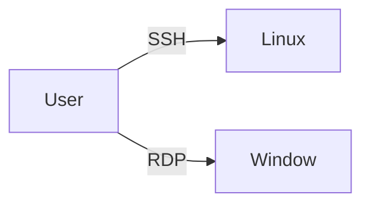
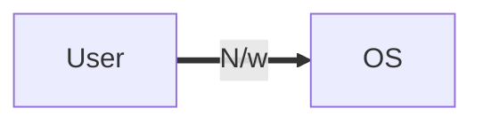
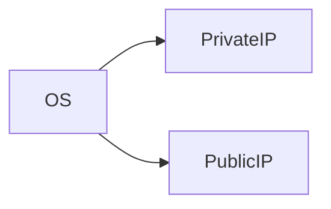
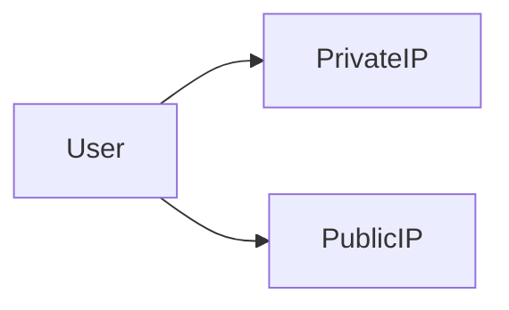

# AWS Solution Architect 

Learn **AWS** with me 🤝

Here I share my daily learning, Hope you will get help from it. If you find this repo insightful then do give it a 🌟 , it will motivate me.  

 
 EC2 

## Before we start with EC2 lets discuss a basic:

-  If we want to run any program, we need OS and in order to perform any task on OS we need Memory / CPU and Storage. The OS which has Basically Memory / CPU and Storage is called System but in AWS these are called Instances, So

### What are Instance?
- Virtual Computing Environment is Known as Instance. 

## Features of EC2: 

### 1. Amazon Machine Images(AMI):

-  Pre configured Templates for your instances is known as Amazon Machine Image(AMI) 

### 2. Instance Type: 
-  Various Configuration of CPU, memory , storage and networking capacity for your indtances is known as Istance type. 

### 3. Key pairs:

- Secure login information for your instance, AWS stores the public key and you store the private key in secure place. 

### 4. Amazon EBS Volume:
- Persistent storage volume for your data using Amazon Elastic Block Store 

### 5. Instance Store Volume:
- Storage Volume for temporary data that's deleted when you stop, hibernate or terminate your instance.

### 6. Security Group:
- A firewall that enables you to specify the protocol, ports and source IP ranges that can reach your instances using security group.

### 7. Elastic IP:
- Static IPV4 Address for dynamic cloud computing, known as Elastic IP addresses.

### 8. EC2 Resources:
- Metadata, known as tags, that you can create and assign to your EC2 resources.

### 9. Region and Availability Zone:
- Multiple physical locations for uoir resources such as Instance and Amazon EBS Volume known as Regions  and Availability Zone.

### 10. Virtual Private Cloud(VPC):
-  Virtual  Networks you can create that are logically isolated from the rest of the AWS cloud, and that can optionally connect to your own Network, known as VPC.  

## Self Notes: 

 
 Security Group 

## What is Security Group?
- A security group acts as virtual firewall for your EC2 instance to control incomming and outgoing trafffic.

- Private key does not support in Remote window but Private key is gateway to the window password

- Window gives encrypted password, we need to decrypt the password using private key

- If we want anyone from outside world to connect through network is by using the **Port number**

- Thre traffic comming from outside the network is called **Ingress** or **Inbound traffic**

### Note

- If somebody know IP and Port number, they can connect to our OS, but if we don't want them to connect, we need to **restrict** them

- To restrict,  we need to put security **outside** the OS

- Before they hit the IP, they are restricted, for that we need to provide **Security**

- The Security in AWS is managed by **Security Group** and for providing the scurity we need ti provide **list** of who can connect

- This list contains the rule like **SSH Port 22**, we can give source IP

- After setting the rules only selected public IP will be allowed to connect

> If we want to provision instance we need to provide Security Group, it ios compulsory

- OS never know about Public IP, but it is there
- **Public IP** are only available when we are using Internet

- Internally they are uisng Public IP to connect **(Natting)** because over Internet private IP won't work

### Natting

- **Network Address Translation(NAT)** is a method of mapping an IP address space into another by modifying network address information in the IP header of packet while they are in transit accross the traffic routing device

