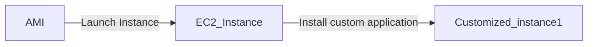
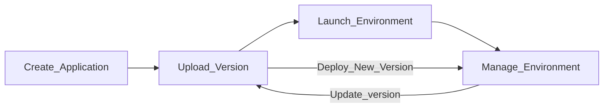
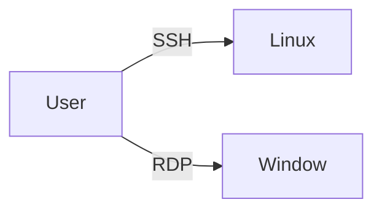
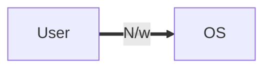
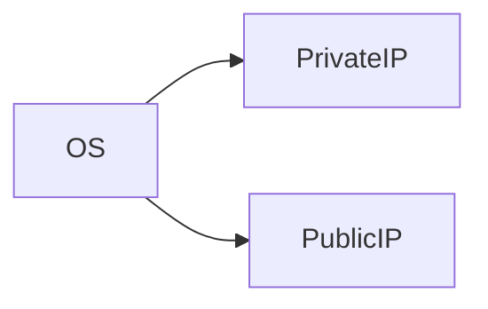
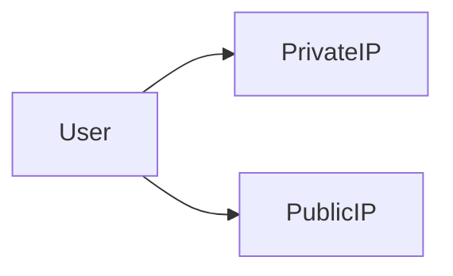

## AWS Solution Architect  

Learn **AWS** with me 🤝

Here I share my daily learning, Hope you will get help from it. If you find this repo insightful then do give it a 🌟 , it will motivate me.  

 <h1>Compute</h1>

- Compute resources can be consider the brains and processing power required by applications and systems to cary out computational tasks via a series of instructions.

- It is closely related to common server component such as **RAM** and **CPU**

EC2

## Before we start with EC2 lets discuss a basic:

-  If we want to run any program, we need OS and in order to perform any task on OS we need Memory / CPU and Storage. The OS which has Basically Memory / CPU and Storage is called System but in AWS these are called Instances, So

### EC2:
- It allows you to deploy virtual server within your AWS environment

### What are Instance?
- Virtual Computing Environment is Known as Instance. 

### Instance Purchasing Options: 
1. On Demand Instance
2. Reserved Instance
3. Scheduled Instance
4. Spot Instance
5. On Demand Capacity Reservation

> On Demand Instances: 
- Can be launched at any time
- Can be used for as long as needed 
- Flat rate determined on the instance type
- Typical used for short term uses
- Best fit for testing and development environment

> Reserved Instance:
- Purchase for a set of period of time for reduced cost

> Scheduled Instance:
- You pay for the reservation on a recurring Schedule, either daily, weekly or monthly

> Spot Instance
- Bid for a unused EC2 comuter resource
- No guarantees for a fixed period of time
- Fluctuation of price based on supply and demand
- Purchase large EC2 instance at a very low price

> On Demand Capacity Reservation:
- Reserve capacity based on different attributes such as instance type, platform and tenancy within a particular Availability Zone for any period of time

### Tenancy:
- This is related to what underlying host your EC2 instance will reside on, so essentially the physical server within an AWS Data Center

### Types of Tenancy:
1. Shared Tenancy
2. Dedicated Tenancy
3. Dedicated Hosts

> Shared Tenancy:
- EC2 instance is launched on any available host with the required resources
- The same host may be used by multiple customers
- AWS Security mechanisms prevent on EC2 instance accessing another in the same host

> Dedicated Instances:
- Hosted on hardware that no other customer can access
- May be required to meet compilance
- Dedicated instance incur additional charges

> Dedicated Hosts:
- Addional visibility and control on the physical host 
- Allows to use the same host for a number of instances
- May be required to meet compilance

## Features of EC2: 

### 1. Amazon Machine Images(AMI):

-  Pre configured Templates for your instances is known as Amazon Machine Image(AMI) 

### 2. Instance Type: 
-  Various Configuration of CPU, memory , storage and networking capacity for your indtances is known as Istance type. 

### 3. Key pairs:

- Secure login information for your instance, AWS stores the public key and you store the private key in secure place. 

### 4. Amazon EBS Volume:
- Persistent storage volume for your data using Amazon Elastic Block Store 

### 5. Instance Store Volume:
- Storage Volume for temporary data that's deleted when you stop, hibernate or terminate your instance.

### 6. Security Group:
- A firewall that enables you to specify the protocol, ports and source IP ranges that can reach your instances using security group.

### 7. Elastic IP:
- Static IPV4 Address for dynamic cloud computing, known as Elastic IP addresses.

### 8. EC2 Resources:
- Metadata, known as tags, that you can create and assign to your EC2 resources.

### 9. Region and Availability Zone:
- Multiple physical locations for uoir resources such as Instance and Amazon EBS Volume known as Regions  and Availability Zone.

### 10. Virtual Private Cloud(VPC):
-  Virtual  Networks you can create that are logically isolated from the rest of the AWS cloud, and that can optionally connect to your own Network, known as VPC.  

### User Data:
- Allows you to enter commands that will run during the first boot cycle of the instance.

## Storage Option:
- Selecting storage for your EC2 instance will depend on the instance selected, what you intend to use the instance for and how critical the data is

> Persistent Storage (Permanent)
- Available by attaching EBS Volume

> Ephemeral Storage (Temporary)
- Created by EC2 instance using local storage

## Self Notes: 

ECS

- ECS(EC2 Container Service) is a service that allows you to run Docker enabled applications packaged as container across a cluster of EC2 instance without requiring you to manage a complex and adminstratively heavy cluster management system

- The cluster management system is abstracted with ECS service by passing that responsibily over to AWS, specifically through the use of **AWS Fargate**

- With Amazon ECS there is no need to install any management or monitoring software for your cluster

### AWS Fargate

- AWS Fargate is an engine used to enable ECS to run containers without having to manage and provision instance and cluster for containers

### Docker
- Docker is a piece of software that allows you to automate the installation and distribution of application inside Linux Containers

### Container
- A Container holds everything an application needs to run from within its container package

- They are decoupled from the operating system, making Container applications very portable

> When launching ECS Cluster you have option of 2 different deployment modes:
1. Fargate launch
2. EC2 launch

> Fargate launch
- It requires you to specify the CPU and memory required, define networking and IAM policies, in addition to you having to package your application into containers

> EC2 launch
- You are responsible for patching and scaling your instance type and how many containrs should be in a cluster

### Monitoring Containers

- Monitoring is taken care of through the use of **Amazon CloudWatch**

- Using CloudWatch you can easily create alarms based off these matrics, providing you notification of when specific events occur, such as a your cluster size scaling up or down

### AMazon ECS Cluster

- An Amazon ECS cluster is comprised of a collection of EC2 instances
- Cluster act as a resourse pool, aggregating resourses such as CPU and memory
- Clusters are dynamically scalable and multiple instance can be used
- Cluster can only scale in a single region
- Containers can be scheduled to be deployed across your cluster
- Instance within the cluster also have a Docker daemon and an ECS agent

ECR

- **Elastic Container Registry(ECR)** provides a secure location to store and manage your docker images
- This is a fully managed service, so you don't need to provision any infrastructure to allow you to create this registry of docker images
- This allow developers to push,pull and manage their library of docker images in a central and secure location

### Registry
- The ECR registry allows you to host and store your docker images, as well as create image repositories

- By default the URL for the registry is as follows:
> https://**aws_account_id**.dkr.ecr.**region**.amazonaws.com

- The account has both read and write access by default to any images you create within the registry and any repository
- Access to your regustry and images can be controlled via **IAM** policies in addition to **registry policies**
- Before your docker client can access your registry, it needs to be authenticated as an AWS user via an **Authorization token**

### Authorization Token

-  To begin the authoization process to communicate your docker client with your default registry, you can run the get-login command using AWS CLI
> aws ecr get-login-password --region **region** --no-include-email

- This will produce an output response which will be a docker login command
> docker login -u AWS -p **password**
> https://**aws_account_id**.dkr.ecr.**region**.amazonaws.com

- This process produces an authorization token that can be used within the registry for 12 hours

### Repository

- These are objects within your registry that allow you to group together and secure different docker images
- You can create multiple repositories with the registry allowing you to origanize and manage your docker images into different categories
- Using policies from both IAM and repository policies you can assign set permissions to each repository

## Repository Policy
- There are a number of different IAM managed policies to help you control access to ECR:

>AmazonEC2ContainerRegistoryFullAcess
>AmazonEC2ContainerRegistoryPowerUser
>AmazonEC2ContainerRegistoryReadOnly

- Repository policies are resource based policies
- You need to ensure you add a principal to the policy to determine who has access and what permission they have

- For an AWS user to gain access to the registry they will require access to **ecr:GetAuthorizationToken** API call

- Once they have this access,  repository policies can control what actions those users can perform on each of the repositories

 ### Images
 - Once you have configured your registry, repositories and security controls and authenticated your docker client with ECR, you can then begin storing your docker images in the required repositories

 - To push an image into ECR, you can use the docker push command, and to retrieve an image you can use the docker pull command

 

 EKS

### Kubernetes:
- Kubernetes is an Open-source container orchestration tool design to automate, deploy, scale and operate containerized applications

- It can grow from tens, thousands, or even millions of containrs 

- It is container-runtime agnostic

---
- AWS provide a managed service allowing you to run Kubernetes across your AWS infrastructure without having to take care of provisioning and running the kubernetes management infrastructure in what's referred to as the **control plane**

- You only need to provision and maintain the worker nodes

### Kubernetes Control Plane
- There are a number of different components that make up the control plane and these include a number of different API's, the Kubelet process and the Kubernetes Master
- The control plane schedules containers onto nodes
- The control plane also tracks the state of all kubernetes objects by continually monitoring the objects
- In EKS, AWS is responsible for provisioning, scaling and managing the control plane, and they do this by utilizing multiple availability zones for additional resilience

### Worker Nodes
> Kubernetes cluster are composed of nodes
- A node is a worker machine in kubernetes. It run as an on-demand EC2 instance and include software to run containers
- For each node created, a specific AMI is used, which also ensures Docker and the Kubelet is installed for security controls
- Once the worker nodes are provisioned they can then connect to EKS using an endpoint

AWS Elastic Beanstalk

- AWS Elastic BeanStalk is an AWS managed service that takes your uploaded code of your web application code and automatically provisions and deploys the required resources within AWS to make the web applicaiton operational

- The resources inlcude EC2, Auto Scaling, application health monitoring and Elastic Load Balancing, in addition to capacity provisioning

- It is an ideal service for engineers who may not have the familiarity or the necessary skills within AWS to deploy, provision, monitor and scale the correct environment to run the developed applications instead this responsibilty is passed on to the AWS Elastic BeansStalk to deploy the correct infrastructure to run the uploaded code

- In elastic beanstalk you can continue to support and maintain the environment as you would with a custom built environment

- You can perform some maintenance taks from the Elastic Beanstalk dashboard itself

- Elastic Beanstalk is able to operate with a variety of platforms and programming languages making it a flexible service for your DevOps team

> The service itself is free to use
- There is no cost associated with Elastic Beanstalk, however, any resources that are created on your application's bealf, such as EC2 instances, you will be charged for as per the standard pricing policies at the time of deployment

### Elastic Beanstalk Core Components:
> 1. Application Version
- An application version is a very specific reference to a section of deployable code.
- The application version will point typically to S3, simple storage service to where the deployable code may reside

> 2. Evironment
- An environment refers to an application version that has been deployed on AWS resources, which are configured and provisioned by AWS Elastic Beanstalk
- At this stage, the application is deployed as a solution and becomes operational within your environment
- The environment is comprised af All the resources created by Elastic Beanstalk and not just an EC2 instance with your uploaded code

> 3. Environment Configuration
- This is a collection of parameters and settings that dictate how an environment will have its resources provisioned by Elastic Beanstalk and how these resources will behave

> 4. Environment Tier

AWS Elastic Beanstalk has two types of envornment tiers to support different types of web application:
- If the application manages and handles HTTP request then the app will be run in **Web server environment**

- If the application does not process HTTP requests, and instead perhaps pulls data from an SQS queue, then it would run in a **worker environment**

> 5. Configuration Template
- This is the template that provides the baseline for creating a new, unique, environment configuration

> 6. Platform
- Platform is a culminatin of components in which you can build your application upon using Elastic Beanstalk
- These comprise of the OS of the instance, the programming language, the server type(web or application) and components of Elastic Beanstalk itself, and as a whole can be defined as a platform.

> 7. Applications
- An applications is a collection of different elements, such as environments, environment configurations and application version

- You can deploy your application in two differnt envionments:
1. Web server envonment
2. Worker environment

##### Web server environment
- This is typically used for standard web applications that operate and serve request over HTTP port 80
>Route 53
Elastic Load Balancer
Auto Scaling
EC2
Security Groups

##### Worker Environment
- It is used by application that will have a back end processing task, that will interact with AWS SQS
>SQS Queue
IAM Service Role
Auto Scaling
EC2

### Elastic Beanstalk Workflow:
Elastic Beanstalk operates a very simple workflow process for your application deployment and ongoing management

 
 Security Group 

## What is Security Group?
- A security group acts as virtual firewall for your EC2 instance to control incomming and outgoing trafffic.

- Private key does not support in Remote window but Private key is gateway to the window password

- Window gives encrypted password, we need to decrypt the password using private key

- If we want anyone from outside world to connect through network is by using the **Port number**

- Thre traffic comming from outside the network is called **Ingress** or **Inbound traffic**

### Note

- If somebody know IP and Port number, they can connect to our OS, but if we don't want them to connect, we need to **restrict** them

- To restrict,  we need to put security **outside** the OS

- Before they hit the IP, they are restricted, for that we need to provide **Security**

- The Security in AWS is managed by **Security Group** and for providing the scurity we need ti provide **list** of who can connect

- This list contains the rule like **SSH Port 22**, we can give source IP

- After setting the rules only selected public IP will be allowed to connect

> If we want to provision instance we need to provide Security Group, it is compulsory

- OS never know about Public IP, but it is there
- **Public IP** are only available when we are using Internet

- Internally they are uisng Public IP to connect **(Natting)** because over Internet private IP won't work

### Natting

- **Network Address Translation(NAT)** is a method of mapping an IP address space into another by modifying network address information in the IP header of packet while they are in transit accross the traffic routing device

 
 Storage 

### What is Storage?

- Storage is one kind of device use for storing data permanent(Persistent)

- Storage is divided into three parts depending upon what kind of data you want to store

- If the kind of data changes then the type of store changes

### Types of Storage:

1. **Object Storage**
2. **Block Storage**
3. **File Storage**

**Object Storage** :

- To store the data peristent and if we don't want to install the OS then we use Object Storage. Example - Google Drive, DropBox

In *AWS* we have a service that provides *Object Storage As A Service* and the name of that service is **S3(Simple Storage Service)** 

**Block Storage** : 

- Any storage device which is required to install the OS is known as Block Storage. Example- Hard Disk

- In *AWS* we have a service that provide **Block Storage AS a Service** is **EBS(Elastic Block Store)**

- EBS is a sub service of EC2

**File Storage**:

- [Comming Soon]

### Note 
- In AWS if we want to install any OS for that we require template which is called AMI and it is installed in **Block Device**

- In AWS there are 3 types of Block device

### Types of Block Device

1. **Root Block Device**
2. **Empherial Block Device**
3. **Elastic Block Store**

**Root Block Device**
- The only way to install os is by using thre Root Block storage

**EBS** : 
- It's like an external storage which we can attach and deattach and os can be install in it.

**Empheral Storage Device**
- [Comming Soon]

# Reference:

[Cloud Academy](https://cloudacademy.com)

