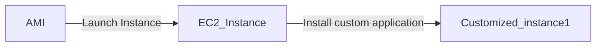
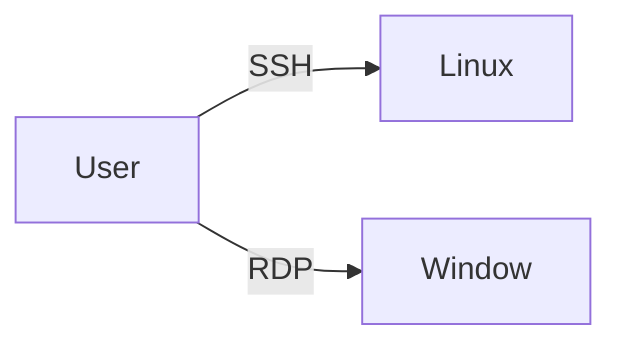
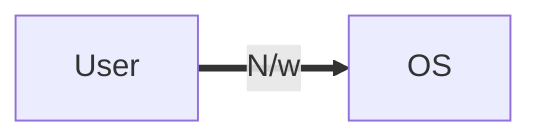
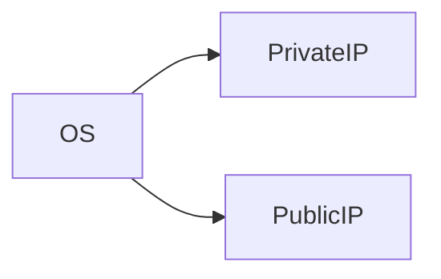
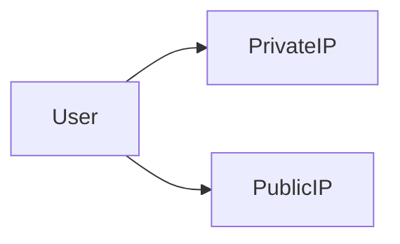

## AWS Solution Architect  

Learn **AWS** with me 🤝

Here I share my daily learning, Hope you will get help from it. If you find this repo insightful then do give it a 🌟 , it will motivate me.  

 
Compute

- Comoute resources can be consider the brains and processing power required by applications and systems to cary out computational tasks via a series of instructions.

- It is closely related to common server component such as **RAM** and **CPU**

In AWS there are services that provice **Compute as a Service**: 

1. EC2

## Before we start with EC2 lets discuss a basic:

-  If we want to run any program, we need OS and in order to perform any task on OS we need Memory / CPU and Storage. The OS which has Basically Memory / CPU and Storage is called System but in AWS these are called Instances, So

### EC2:
- It allows you to deploy virtual server within your AWS environment

### What are Instance?
- Virtual Computing Environment is Known as Instance. 

### Instance Purchasing Options: 
1. On Demand Instance
2. Reserved Instance
3. Scheduled Instance
4. Spot Instance
5. On Demand Capacity Reservation

>> On Demand Instances: 
- Can be launched at any time
- Can be used for as long as needed 
- Flat rate determined on the instance type
- Typical used for short term uses
- Best fit for testing and development environment

2.  Reserved Instance:
- Purchase for a set of period of time for reduced cost

### Scheduled Instance:
- You pay for the reservation on a recurring Schedule, either daily, weekly or monthly

### Spot Instance
- Bid for a unused EC2 comuter resource
- No guarantees for a fixed period of time
- Fluctuation of price based on supply and demand
- Purchase large EC2 instance at a very low price

### On Demand Capacity Reservation:
- Reserve capacity based on different attributes such as instance type, platform and tenancy within a particular Availability Zone for any period of time

### Tenancy:
- This is related to what underlying host your EC2 instance will reside on, so essentially the physical server within an AWS Data Center

### Types of Tenancy:
- Shared Tenancy
- Dedicated Tenancy
- Dedicated Hosts

### Shared Tenancy:
- EC2 instance is launched on any available host with the required resources
- The same host may be used by multiple customers
- AWS Security mechanisms prevent on EC2 instance accessing another in the same host

### Dedicated Instances:
- Hosted on hardware that no other customer can access
- May be required to meet compilance
- Dedicated instance incur additional charges

### Dedicated Hosts:
- Addional visibility and control on the physical host 
- Allows to use the same host for a number of instances
- May be required to meet compilance

## Features of EC2: 

### 1. Amazon Machine Images(AMI):

-  Pre configured Templates for your instances is known as Amazon Machine Image(AMI) 

### 2. Instance Type: 
-  Various Configuration of CPU, memory , storage and networking capacity for your indtances is known as Istance type. 

### 3. Key pairs:

- Secure login information for your instance, AWS stores the public key and you store the private key in secure place. 

### 4. Amazon EBS Volume:
- Persistent storage volume for your data using Amazon Elastic Block Store 

### 5. Instance Store Volume:
- Storage Volume for temporary data that's deleted when you stop, hibernate or terminate your instance.

### 6. Security Group:
- A firewall that enables you to specify the protocol, ports and source IP ranges that can reach your instances using security group.

### 7. Elastic IP:
- Static IPV4 Address for dynamic cloud computing, known as Elastic IP addresses.

### 8. EC2 Resources:
- Metadata, known as tags, that you can create and assign to your EC2 resources.

### 9. Region and Availability Zone:
- Multiple physical locations for uoir resources such as Instance and Amazon EBS Volume known as Regions  and Availability Zone.

### 10. Virtual Private Cloud(VPC):
-  Virtual  Networks you can create that are logically isolated from the rest of the AWS cloud, and that can optionally connect to your own Network, known as VPC.  

### User Data:
Allows you to enter commands that will run during the first boot cycle of the instance.

## Storage Option:
- Selecting storage for your EC2 instance will depend on the instance selected, what you intend to use the instance for and how critical the data is

- Persistent Storage (Permanent)
Available by attaching EBS Volume

- Ephemeral Storage (Temporary)
Created by EC2 instance using local storage

## Self Notes: 

 
 Security Group 

## What is Security Group?
- A security group acts as virtual firewall for your EC2 instance to control incomming and outgoing trafffic.

- Private key does not support in Remote window but Private key is gateway to the window password

- Window gives encrypted password, we need to decrypt the password using private key

- If we want anyone from outside world to connect through network is by using the **Port number**

- Thre traffic comming from outside the network is called **Ingress** or **Inbound traffic**

### Note

- If somebody know IP and Port number, they can connect to our OS, but if we don't want them to connect, we need to **restrict** them

- To restrict,  we need to put security **outside** the OS

- Before they hit the IP, they are restricted, for that we need to provide **Security**

- The Security in AWS is managed by **Security Group** and for providing the scurity we need ti provide **list** of who can connect

- This list contains the rule like **SSH Port 22**, we can give source IP

- After setting the rules only selected public IP will be allowed to connect

> If we want to provision instance we need to provide Security Group, it is compulsory

- OS never know about Public IP, but it is there
- **Public IP** are only available when we are using Internet

- Internally they are uisng Public IP to connect **(Natting)** because over Internet private IP won't work

### Natting

- **Network Address Translation(NAT)** is a method of mapping an IP address space into another by modifying network address information in the IP header of packet while they are in transit accross the traffic routing device

 
 Storage 

### What is Storage?

- Storage is one kind of device use for storing data permanent(Persistent)

- Storage is divided into three parts depending upon what kind of data you want to store

- If the kind of data changes then the type of store changes

### Types of Storage:

1. **Object Storage**
2. **Block Storage**
3. **File Storage**

**Object Storage** :

- To store the data peristent and if we don't want to install the OS then we use Object Storage. Example - Google Drive, DropBox

In *AWS* we have a service that provides *Object Storage As A Service* and the name of that service is **S3(Simple Storage Service)** 

**Block Storage** : 

- Any storage device which is required to install the OS is known as Block Storage. Example- Hard Disk

- In *AWS* we have a service that provide **Block Storage AS a Service** is **EBS(Elastic Block Store)**

- EBS is a sub service of EC2

**File Storage**:

- [Comming Soon]

### Note 
- In AWS if we want to install any OS for that we require template which is called AMI and it is installed in **Block Device**

- In AWS there are 3 types of Block device

### Types of Block Device

1. **Root Block Device**
2. **Empherial Block Device**
3. **Elastic Block Store**

**Root Block Device**
- The only way to install os is by using thre Root Block storage

**EBS** : 
- It's like an external storage which we can attach and deattach and os can be install in it.

**Empheral Storage Device**
- [Comming Soon]

